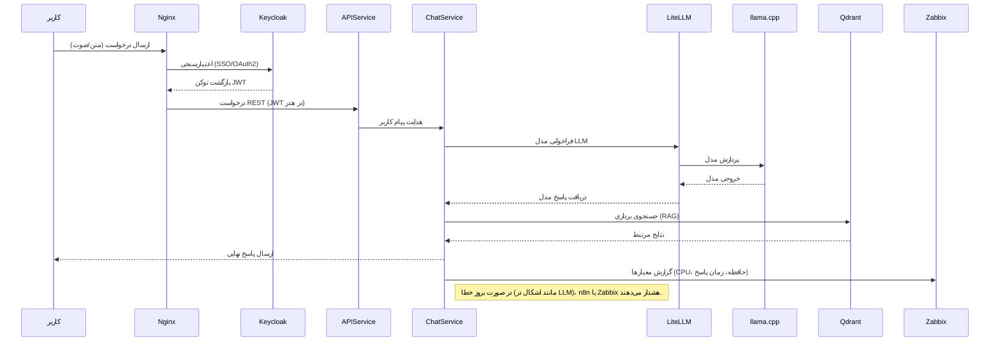
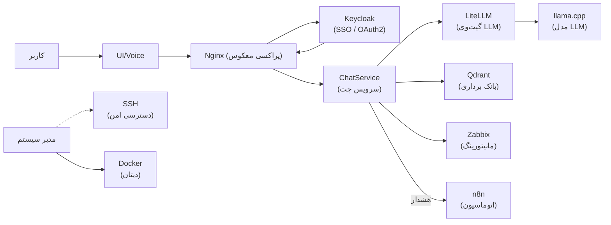
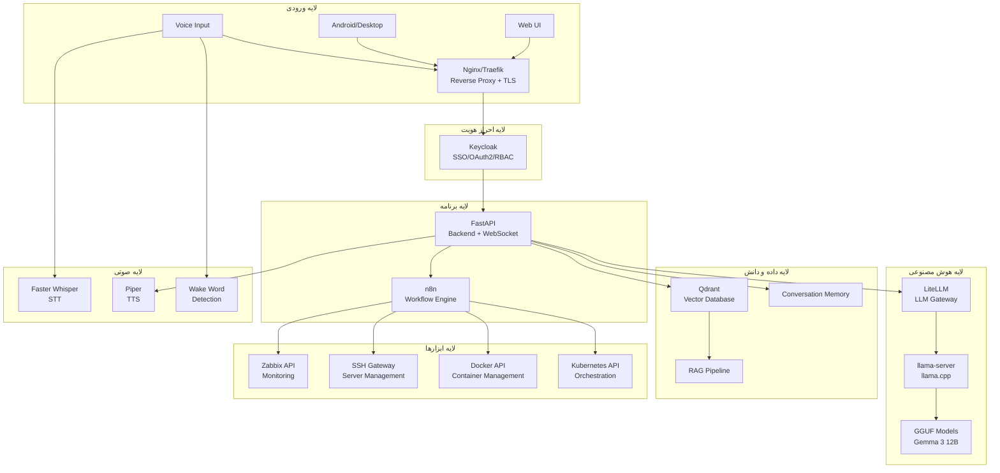
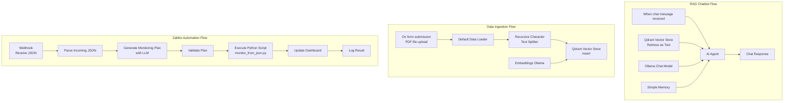
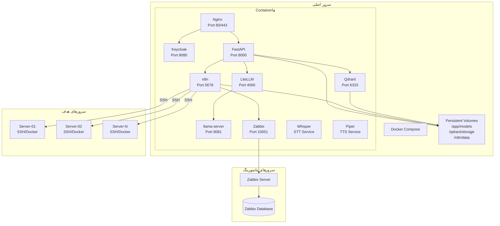

# ai-assistant


# مستند جامع پروژه «دستیار هوش مصنوعی عملیاتی»

**معماری، اجزا، مدل‌های محلی، LLM، n8n، Zabbix، SSH، صدا و زیرساخت**

نسخه مستند: ۱۴۰۵/۰۵/۱۷ | بر اساس گفتگوها و تصمیم‌های ثبت‌شده تا ۸ اوت ۲۰۲۶

---

## فهرست مطالب

1. [خلاصه اجرایی](#۱-خلاصه-اجرایی)
2. [چشم‌انداز نهایی سیستم](#۲-چشم‌انداز-نهایی-سیستم)
3. [معماری منطقی پیشنهادی](#۳-معماری-منطقی-پیشنهادی)
4. [اصل مهم معماری: مدل، مغز تصمیم‌گیری است؛ نه root shell](#۴-اصل-مهم-معماری-مدل-مغز-تصمیم‌گیری-است-نه-root-shell)
5. [سخت‌افزار و محدودیت inference](#۵-سخت‌افزار-و-محدودیت-inference)
6. [مدل‌های بررسی‌شده](#۶-مدل‌های-بررسی‌شده)
7. [llama.cpp و llama-server](#۷-llamacpp-و-llama-server)
8. [ساختار فعلی پوشه مدل](#۸-ساختار-فعلی-پوشه-مدل)
9. [Docker و سرویس llama](#۹-docker-و-سرویس-llama)
10. [Tool Calling و قابلیت‌های llama-server](#۱۰-tool-calling-و-قابلیت‌های-llama-server)
11. [LiteLLM؛ لایه استانداردسازی LLM](#۱۱-litellm-لایه-استانداردسازی-llm)
12. [n8n؛ موتور workflow](#۱۲-n8n-موتور-workflow)
13. [اتصال n8n به LiteLLM](#۱۳-اتصال-n8n-به-litellm)
14. [Zabbix؛ منبع اصلی Monitoring](#۱۴-zabbix-منبع-اصلی-monitoring)
15. [SSH و مدیریت سرورها](#۱۵-ssh-و-مدیریت-سرورها)
16. [Voice Assistant](#۱۶-voice-assistant)
17. [Qdrant و RAG](#۱۷-qdrant-و-rag)
18. [Keycloak و هویت](#۱۸-keycloak-و-هویت)
19. [FastAPI و WebSocket](#۱۹-fastapi-و-websocket)
20. [Nginx / HTTPS / Reverse Proxy](#۲۰-nginx--https--reverse-proxy)
21. [OpenAI-compatible API و جریان درخواست](#۲۱-openai-compatible-api-و-جریان-درخواست)
22. [MCP و Tool Architecture](#۲۲-mcp-و-tool-architecture)
23. [وضعیت فعلی پروژه](#۲۳-وضعیت-فعلی-پروژه)
24. [مشکلات و چالش‌های ثبت‌شده](#۲۴-مشکلات-و-چالش‌های-ثبت‌شده)
25. [ساختار repository پیشنهادی](#۲۵-ساختار-repository-پیشنهادی)
26. [قرارداد Toolها](#۲۶-قرارداد-toolها)
27. [سیاست امنیتی پیشنهادی](#۲۷-سیاست-امنیتی-پیشنهادی)
28. [Prompt و رفتار Agent](#۲۸-prompt-و-رفتار-agent)
29. [MVP پیشنهادی](#۲۹-mvp-پیشنهادی)
30. [فاز دوم](#۳۰-فاز-دوم)
31. [فاز سوم](#۳۱-فاز-سوم)
32. [ترتیب اجرای عملی پروژه](#۳۲-ترتیب-اجرای-عملی-پروژه)
33. [معیارهای Benchmark](#۳۳-معیارهای-benchmark)
34. [برنامه بنچمارک مدل‌ها](#۳۴-برنامه-بنچمارک-مدل‌ها)
35. [طراحی مانیتورینگ و هشداردهی با Zabbix](#۳۵-طراحی-مانیتورینگ-و-هشداردهی-با-zabbix)
36. [خطوط CI/CD و استقرار](#۳۶-خطوط-cicd-و-استقرار)
37. [مثال جریان‌های کاری n8n](#۳۷-مثال-جریان‌های-کاری-n8n)
38. [استراتژی ایندکس‌گذاری Qdrant](#۳۸-استراتژی-ایندکس‌گذاری-qdrant)
39. [برآورد هزینه و منابع](#۳۹-برآورد-هزینه-و-منابع)
40. [تحلیل ریسک و راهکارهای کاهش](#۴۰-تحلیل-ریسک-و-راهکارهای-کاهش)
41. [برنامه اجرایی فازبندی شده](#۴۱-برنامه-اجرایی-فازبندی-شده)
42. [سناریوی عملیاتی گام‌به‌گام](#۴۲-سناریوی-عملیاتی-گام‌به‌گام)
43. [نمودارهای معماری](#۴۳-نمودارهای-معماری)
44. [جمع‌بندی نهایی](#۴۴-جمع‌بندی-نهایی)
45. [مرجع وضعیت فعلی فایل‌ها و سرویس‌ها](#۴۵-مرجع-وضعیت-فعلی-فایل‌ها-و-سرویس‌ها)

---

## ۱. خلاصه اجرایی

پروژه «AI Assistant» یک دستیار هوش مصنوعی محلی و عملیاتی است که قرار است به‌جای یک چت‌بات صرف، به‌عنوان لایه هوشمند مدیریت زیرساخت عمل کند. ایده اصلی این است که کاربر بتواند با زبان طبیعی، متن یا صدا، درخواست‌هایی مانند بررسی وضعیت سرورها، مشاهده وضعیت Zabbix، ساخت مانیتورینگ، اجرای عملیات SSH، بررسی فایل‌ها، کار با Docker و در مراحل بعد Kubernetes و سایر ابزارهای DevOps را به دستیار بدهد.

در این گزارش جامع، **معماری پیشنهادی** پروژهٔ دستیار هوش مصنوعی همراه با جریان گام‌به‌گام داده و تعاملات سیستم بررسی شده است. سناریوی عملیاتی از لحظهٔ درخواست کاربر تا تولید پاسخ نهایی با تشریح نقش هر مؤلفه (از جمله llama.cpp، LiteLLM، n8n، Zabbix، SSH، Voice، Qdrant، Keycloak، Nginx، MCP و Docker) و جریان داده‌های مربوطه ارائه شده است.

محدودیت سخت‌افزاری فعلی پروژه:
- بدون GPU
- حدود ۴۰ هسته CPU
- حداکثر ۳۰ هسته قابل اختصاص به inference
- ۳۲GB RAM

به همین دلیل تمرکز فعلی روی مدل‌های GGUF، llama.cpp/llama-server و اجرای CPU است.

---

## ۲. چشم‌انداز نهایی سیستم

چشم‌انداز معماری مورد بحث در گفتگوها به‌صورت زیر است:

- کاربر از Web UI، کلاینت دسکتاپ، Android یا رابط صوتی وارد سیستم می‌شود.
- Traefik یا Nginx لایه ورودی، TLS و reverse proxy را مدیریت می‌کند.
- Keycloak برای هویت، احراز هویت و در آینده RBAC/SSO در نظر گرفته شده است.
- FastAPI لایه backend/orchestration و WebSocket ارتباط زنده را فراهم می‌کند.
- LLM محلی از طریق llama-server در اختیار LiteLLM و سپس سرویس‌های بالادستی قرار می‌گیرد.
- n8n برای workflow و اتصال سرویس‌ها، APIها و عملیات چندمرحله‌ای استفاده می‌شود.
- Zabbix منبع اصلی monitoring و metrics است.
- SSH gateway/tool layer امکان اجرای کنترل‌شده عملیات روی سرورها را فراهم می‌کند.
- Qdrant در معماری پیشنهادی برای RAG و حافظه دانش فنی/مستندات در نظر گرفته شده است.
- لایه صوتی شامل Faster Whisper برای STT و Piper برای TTS است و wake-word نیز در طراحی مطرح شده است.

---

## ۳. معماری منطقی پیشنهادی

```
Clients
├── Web UI
├── Android
├── Desktop
└── Voice
│
▼
Nginx / Traefik
│
▼
Keycloak
│
▼
FastAPI + WebSocket
│
├──────────────► n8n Workflow Engine
│ │
│ ├── Zabbix API
│ ├── SSH / Server Tools
│ ├── Docker / Kubernetes
│ └── Other APIs
│
├──────────────► LiteLLM
│ │
│ ▼
│ llama-server
│ │
│ ▼
│ Local GGUF Model
│
├──────────────► Qdrant / RAG
│
└──────────────► Voice Layer
    ├── Faster Whisper (STT)
    ├── Wake Word
    └── Piper (TTS)
```

---

## ۴. اصل مهم معماری: مدل، مغز تصمیم‌گیری است؛ نه root shell

یکی از مهم‌ترین اصولی که برای ادامه پروژه باید حفظ شود این است که LLM نباید مستقیماً shell یا APIهای حساس را بدون لایه کنترل اجرا کند. مدل باید intent را تشخیص دهد، tool مناسب را انتخاب کند و نتیجه را تفسیر کند. اجرای واقعی باید توسط ابزارهای مشخص، محدود و قابل audit انجام شود.

| **لایه** | **وظیفه** | **نمونه** |
|---------------------------|-------------------------------|-----------------------------------|
| LLM | درک درخواست و تصمیم درباره tool | «وضعیت CPU سرور X چیست؟» |
| Tool Layer | تعریف عملیات مجاز | zabbix_get_host_status |
| Policy | کنترل دسترسی و ریسک | فقط read-only برای کاربر عادی |
| Executor | اجرای واقعی | Zabbix API / SSH |
| Audit | ثبت عملیات | کاربر، زمان، command، نتیجه |

---

## ۵. سخت‌افزار و محدودیت inference

| **منبع** | **وضعیت فعلی** |
|-----------------------------------|---------------------|
| GPU | وجود ندارد |
| CPU | ۴۰ هسته |
| CPU اختصاصی inference | حداکثر ۳۰ هسته |
| RAM | ۳۲GB |
| رویکرد مدل | GGUF + llama.cpp / llama-server |
| هدف | دستیار عملیاتی محلی با هزینه و وابستگی کمتر به cloud |

با این منابع، مدل‌های بسیار بزرگ مانند ۲۷B ممکن است از نظر RAM و سرعت برای سرویس interactive فشار زیادی ایجاد کنند. در آزمایش‌های انجام‌شده، مدل‌های کوچک‌تر quantized برای latency و مصرف حافظه منطقی‌تر هستند.

---

## ۶. مدل‌های بررسی‌شده

| **مدل/فایل** | **حجم تقریبی** | **وضعیت/برداشت** |
|---------------------------------|----------------|------------------------------------------|
| gemma-4-E2B-it-Q4_K_M.gguf | ۲.۹GB | موجود؛ گزینه سبک و مناسب CPU |
| gemma-3-12b-it-Q4_K_M.gguf | --- | گزینه جدی برای کیفیت بالاتر روی CPU |
| gemma-2-27b-it-Q5_K_M.gguf | ۱۹GB | موجود؛ سنگین برای RAM و latency فعلی |
| ggml-large-v3-turbo-q5_0.bin | --- | برای Whisper/پردازش صوتی مرتبط با پروژه |

در گفتگوها مشخص شد که GGUF قالب/فرمت مدل‌های quantized برای اجرا با موتورهایی مانند llama.cpp است. بنابراین «GGUF» یک مدل مستقل نیست؛ یک قالب فایل مناسب برای inference محلی است.

---

## ۷. llama.cpp و llama-server

موتور اصلی inference محلی llama.cpp و سرویس HTTP آن یعنی llama-server انتخاب شده است. این سرویس مدل GGUF را load می‌کند و API سازگار با OpenAI-style ارائه می‌دهد تا LiteLLM، n8n یا FastAPI بتوانند از آن استفاده کنند.

تنظیماتی که در آزمایش‌ها مطرح شد:

```bash
llama-server \
-m /app/models/gemma-3-12b-it-Q4_K_M.gguf \
-t 30 \
-c 16384 \
--host 0.0.0.0 \
--port 8081
```

در محیط Docker مسیر مدل به `/app/models` متصل شده و سرویس روی پورت 8081 قرار گرفته است.

---

## ۸. ساختار فعلی پوشه مدل

```
~/llm/
├── docker-compose.yml
├── Dockerfile.cpu
├── entrypoint-cpu.sh
├── entrypoint-cpu.sh.bak
├── gemma-4-E2B-it-Q4_K_M.gguf
├── gemma-2-27b-it-Q5_K_M.gguf
├── gemma-3-12b-it-Q4_K_M.gguf
└── ggml-large-v3-turbo-q5_0.bin
```

---

## ۹. Docker و سرویس llama

برای مدل، یک Docker image اختصاصی CPU ساخته شده و سرویس‌هایی با نام `llama/llama-service` در گفتگوها استفاده شده‌اند. مدل‌ها از طریق volume در `/app/models` در اختیار container قرار گرفته‌اند.

```yaml
services:
  llama-service:
    build:
      context: .
      dockerfile: Dockerfile.cpu
    ports:
      - "8081:8081"
    volumes:
      - ./:/app/models
```

> **نکته مهم:** این نمونه معماری است و باید با docker-compose فعلی پروژه تطبیق داده شود؛ هدف آن نشان دادن قرارداد اصلی بین container و llama-server است.

---

## ۱۰. Tool Calling و قابلیت‌های llama-server

در بررسی help مربوط به llama-server، گزینه‌های `--tools` و `--agent` دیده شد و ابزارهایی مانند `read_file`، `file_glob_search` و `grep_search` نیز در محیط بررسی شدند. این موضوع برای تبدیل LLM از یک chatbot به agent عملیاتی مهم است.

```
--tools TOOL1,TOOL2,...
--agent
```

با این حال، برای محیط production بهتر است toolها به‌صورت explicit، محدود و قابل audit تعریف شوند و commandهای خام shell به‌عنوان tool عمومی در اختیار مدل قرار نگیرند.

---

## ۱۱. LiteLLM؛ لایه استانداردسازی LLM

LiteLLM در پروژه به‌عنوان gateway/adapter بین کلاینت‌ها و مدل محلی قرار گرفته است. مزیت آن این است که APIها را به شکل OpenAI-compatible در اختیار n8n و سایر سرویس‌ها قرار می‌دهد و در آینده امکان اضافه‌کردن مدل‌های دیگر را بدون تغییر تمام clientها ساده‌تر می‌کند.

```
Client / n8n
│
▼
LiteLLM
│
▼
llama-server :8081
│
▼
GGUF model
```

در تست‌های اخیر endpoint مربوط به completion از LiteLLM روی پورت 4000 استفاده شد.

---

## ۱۲. n8n؛ موتور workflow

n8n در پروژه برای ساخت workflowهای قابل مشاهده و قابل اتصال به APIها استفاده شده است. image مورد استفاده در گفتگوها `n8nio/n8n:latest` بوده است.

الگوی اصلی workflow مورد نظر:

1. Trigger → دریافت درخواست یا زمان‌بندی
2. LLM → تفسیر درخواست
3. Tool Selection → انتخاب عملیات
4. Zabbix API / SSH / Docker API → اجرای عملیات
5. Transform → تبدیل داده
6. LLM → خلاصه‌سازی و پاسخ انسانی
7. Response → بازگرداندن نتیجه به WebSocket/UI/Voice

---

## ۱۳. اتصال n8n به LiteLLM

برای n8n، LiteLLM باید به‌عنوان endpoint مدل OpenAI-compatible معرفی شود. در این ساختار n8n مستقیماً به فایل GGUF یا llama-server وابسته نیست و فقط LiteLLM را می‌شناسد.

```
n8n
│
└── HTTP / OpenAI-compatible
    │
    ▼
LiteLLM :4000
    │
    ▼
llama-server :8081
```

---

## ۱۴. Zabbix؛ منبع اصلی Monitoring

یکی از اهداف اصلی دستیار این است که کاربر بتواند با زبان طبیعی درباره monitoring سؤال کند یا configuration ایجاد کند. در گفتگوها workflowهایی برای اتصال به Zabbix API، دریافت metric، transform داده و آماده‌سازی برای dashboard/alerting بررسی شد.

| **درخواست کاربر** | **عملیات پیشنهادی** |
|--------------------------------------|----------------------------------------------|
| «وضعیت سرور X را بگو» | Host discovery + availability + آخرین metricها |
| «CPU این سرور چقدر است؟» | دریافت itemهای CPU و تحلیل trend |
| «برای این سرور monitoring بساز» | بررسی template → ایجاد/اتصال host → ساخت item/trigger طبق policy |
| «مشکل چیست؟» | ترکیب چند metric و event و ارائه root-cause احتمالی |

برای عملیات write در Zabbix باید تأیید کاربر، RBAC و audit در نظر گرفته شود؛ مخصوصاً برای حذف یا تغییر template، trigger و host.

---

## ۱۵. SSH و مدیریت سرورها

بخش مهم دیگر پروژه، توانایی دستیار برای دسترسی به سرورها از طریق SSH است. مدل باید بتواند درخواست را به عملیات ساختاریافته تبدیل کند؛ مثلاً `check_disk`، `check_service`، `docker_ps` یا `collect_logs`. اجرای command خام باید استثنایی و تحت policy باشد.

```
User
│
▼
LLM: «وضعیت Docker روی server-01 را بررسی کن»
│
▼
Tool: docker_ps(host=server-01)
│
▼
SSH Executor
│
▼
server-01
│
▼
Structured Result
│
▼
LLM → پاسخ فارسی/انگلیسی به کاربر
```

---

## ۱۶. Voice Assistant

در طراحی، رابط صوتی نیز بخشی از پروژه است. مسیر مورد نظر شامل دریافت صدا، تشخیص wake word، تبدیل Speech-to-Text، ارسال متن به agent، اجرای toolها، تولید پاسخ و در نهایت Text-to-Speech است.

```
Microphone
↓
Wake Word
↓
Faster Whisper / STT
↓
FastAPI / Agent
↓
LLM + Tools
↓
Piper / TTS
↓
Speaker
```

فایل `ggml-large-v3-turbo-q5_0.bin` نیز در محیط مدل‌ها وجود دارد و برای بخش Whisper مورد توجه قرار گرفته است.

---

## ۱۷. Qdrant و RAG

Qdrant برای ذخیره embeddingها و بازیابی دانش مرتبط در نظر گرفته شده است. هدف RAG این است که مدل بتواند به جای تکیه فقط بر دانش عمومی خود، به مستندات داخلی، runbookها، configurationها، توضیحات سرویس‌ها و دانش عملیاتی سازمان رجوع کند.

**نمونه منابع RAG:**
- مستندات سرورها و سرویس‌ها
- Runbookهای incident و عملیات
- مستندات Zabbix
- README و documentation پروژه‌ها
- توضیحات معماری شبکه
- تاریخچه incidentهای حل‌شده

---

## ۱۸. Keycloak و هویت

Keycloak در معماری برای مدیریت identity و authentication در نظر گرفته شده است. در نسخه production باید identity از authorization جدا باشد: احراز هویت توسط Keycloak و تصمیم درباره مجاز بودن tool توسط policy/RBAC خود agent.

| **Role** | **نمونه دسترسی** |
|--------------------------|--------------------------------------------|
| Viewer | فقط خواندن وضعیت و metric |
| Operator | اجرای toolهای عملیاتی محدود |
| Admin | تغییر configuration با approval |
| AI Service | service account با کمترین privilege لازم |

---

## ۱۹. FastAPI و WebSocket

FastAPI به‌عنوان backend اصلی پیشنهادی برای agent استفاده می‌شود. WebSocket برای streaming پاسخ مدل، وضعیت اجرای toolها، و تعامل زنده با UI مناسب است.

```
Client
│ WebSocket
▼
FastAPI
├── Auth
├── Conversation
├── Agent
├── Tool Registry
├── Policy
└── Streaming
    │
    ├── LiteLLM
    ├── n8n
    ├── Zabbix
    ├── SSH
    └── Qdrant
```

---

## ۲۰. Nginx / HTTPS / Reverse Proxy

در محیط فعلی پروژه، Nginx برای routing سرویس‌ها استفاده شده است. در یکی از setupها سرویس‌های n8n روی 5678، llama-service روی 8081 و nginx-ui روی 9000 قرار داشتند و routeهایی مانند `/n8n/` و `/gemma/` مطرح شدند.

```nginx
upstream n8n {
    server n8n:5678;
}

upstream llama {
    server llama-service:8081;
}
```

یک مشکل مشخص در گفتگوها این بود که Gemma روی HTTP کار می‌کرد ولی روی HTTPS مشکل داشت و خطای `421 Misdirected Request` نیز دیده شد. این مسئله به routing، Host/SNI و تنظیمات reverse proxy مربوط است و باید در deployment نهایی به‌صورت یکپارچه حل شود.

---

## ۲۱. OpenAI-compatible API و جریان درخواست

```
POST /v1/chat/completions
│
▼
LiteLLM
│
▼
llama-server API
│
▼
GGUF
│
▼
Response
│
▼
n8n / FastAPI / UI
```

این قرارداد باعث می‌شود backend و UI به implementation مدل وابسته نباشند و در صورت تعویض Gemma با مدل دیگر، تغییرات معماری محدودتر شود.

---

## ۲۲. MCP و Tool Architecture

در گفتگوها MCP نیز به‌عنوان گزینه‌ای برای استانداردسازی اتصال مدل به ابزارها بررسی شد. نقش MCP در این پروژه می‌تواند ایجاد یک قرارداد تمیز بین Agent و سرویس‌های خارجی باشد. با این حال، MCP جایگزین policy، authentication و audit نیست.

| **رویکرد** | **نقش در پروژه** |
|-----------------------------|------------------------------------------------|
| Native tool calling | ابزارهای مستقیم در agent |
| MCP | قرارداد استاندارد برای tool/resource |
| n8n | workflow و orchestration چندمرحله‌ای |
| FastAPI | API، session، auth و کنترل مرکزی |

---

## ۲۳. وضعیت فعلی پروژه

- اجرای مدل GGUF روی CPU با llama-server
- استفاده از Docker برای سرویس مدل
- وجود مدل‌های Gemma مختلف در `~/llm`
- استفاده از LiteLLM به‌عنوان gateway
- تلاش برای اتصال n8n به LiteLLM
- طراحی workflowهای Zabbix در n8n
- بررسی قابلیت tool/agent در llama-server
- استفاده از Nginx برای reverse proxy
- بررسی routeهای `/n8n/` و `/gemma/`
- بررسی معماری voice با Whisper و Piper
- در نظر گرفتن Qdrant برای RAG

---

## ۲۴. مشکلات و چالش‌های ثبت‌شده

| **چالش** | **وضعیت/راهکار جهت ادامه** |
|-----------------------------------|----------------------------------------------|
| Latency مدل‌های بزرگ روی CPU | مدل quantized کوچک‌تر و context منطقی‌تر |
| مصرف RAM مدل 27B | برای production فعلی گزینه سنگین محسوب می‌شود |
| HTTPS برای Gemma | بررسی Host/SNI، proxy headers و routing |
| 421 Misdirected Request | یکپارچه‌سازی server_name و TLS routing |
| Tool execution امن | Tool registry + RBAC + policy + audit |
| تغییر مدل | استفاده از LiteLLM به‌عنوان abstraction |
| Workflowهای پیچیده | n8n برای orchestration و FastAPI برای کنترل مرکزی |

---

## ۲۵. ساختار repository پیشنهادی

```
ai-assistant/
├── apps/
│   ├── api/          # FastAPI
│   ├── web/          # Web UI
│   └── voice/        # Voice gateway
├── agent/
│   ├── prompts/
│   ├── policies/
│   ├── tools/
│   └── memory/
├── integrations/
│   ├── zabbix/
│   ├── ssh/
│   ├── docker/
│   └── kubernetes/
├── workflows/
│   └── n8n/
├── llm/
│   ├── docker/
│   └── configs/
├── rag/
│   ├── ingestion/
│   └── qdrant/
├── infra/
│   ├── nginx/
│   ├── keycloak/
│   └── compose/
├── docs/
└── tests/
```

---

## ۲۶. قرارداد Toolها

هر tool بهتر است ورودی و خروجی ساختاریافته داشته باشد. مثال:

```json
{
    "name": "zabbix_host_status",
    "description": "Get availability and key status of a Zabbix host",
    "input": {
        "host": "server-01"
    },
    "output": {
        "status": "available",
        "cpu": 42.1,
        "memory": 68.4
    },
    "risk": "read_only"
}
```

این طراحی باعث می‌شود LLM با JSON و schema کار کند و مجبور نباشد متن آزاد را به command shell تبدیل کند.

---

## ۲۷. سیاست امنیتی پیشنهادی

- اصل Least Privilege برای تمام service accountها
- عدم قرار دادن password و private key در prompt
- مدیریت secretها خارج از prompt و source code
- ثبت audit برای تمام عملیات write
- تأیید انسانی برای عملیات destructive یا پرریسک
- محدود کردن SSH به hostهای allowlist
- محدود کردن commandهای مجاز
- Timeout و resource limit برای toolها
- جلوگیری از prompt injection در داده‌های برگشتی از سرورها و مستندات
- تفکیک read-only و write tools

---

## ۲۸. Prompt و رفتار Agent

Agent system prompt باید حداقل این اصول را enforce کند:

- قبل از اجرای عملیات، هدف کاربر را دقیق تشخیص بده
- برای عملیات read از tool مناسب استفاده کن
- برای عملیات write در صورت نیاز تأیید بگیر
- هرگز secret را در پاسخ نمایش نده
- اگر داده کافی نیست، حدس نزن؛ tool مناسب را اجرا یا سؤال مشخص بپرس
- نتیجه tool را از خودت جدا کن و در صورت خطا آن را شفاف گزارش کن
- در پاسخ نهایی خلاصه‌ای قابل فهم از اقدام، نتیجه و خطا ارائه بده

---

## ۲۹. MVP پیشنهادی

برای جلوگیری از پیچیده‌شدن پروژه، MVP بهتر است فقط این قابلیت‌ها را داشته باشد:

- Chat UI ساده
- Keycloak authentication
- FastAPI backend
- LiteLLM
- یک مدل Gemma GGUF
- Zabbix read-only tools
- SSH read-only tools
- n8n برای workflowهای مشخص
- Streaming response
- Audit log

---

## ۳۰. فاز دوم

- Zabbix write operations با approval
- Docker tools
- RAG با Qdrant
- مدیریت runbookها
- Voice/STT/TTS
- Dashboard وضعیت Agent
- Tool permission per user/role

---

## ۳۱. فاز سوم

- Kubernetes operations
- Incident response automation
- Self-healing محدود و policy-driven
- MCP ecosystem
- چند مدل و routing هوشمند در LiteLLM
- حافظه بلندمدت conversation/operations
- تحلیل trend و پیش‌بینی failure

---

## ۳۲. ترتیب اجرای عملی پروژه

1. پایدار کردن llama-server روی CPU
2. انتخاب مدل اصلی بر اساس benchmark واقعی روی همین سرور
3. پایدار کردن LiteLLM و API compatibility
4. اتصال n8n و ساخت یک workflow ساده
5. ساخت FastAPI Agent Gateway
6. ساخت اولین Zabbix read-only tools
7. ساخت SSH read-only tools
8. افزودن authentication با Keycloak
9. افزودن policy و audit
10. افزودن Qdrant/RAG
11. افزودن Voice
12. سپس سراغ write operations و automation رفتن

---

## ۳۳. معیارهای Benchmark

انتخاب مدل نباید فقط بر اساس حجم فایل انجام شود. روی سخت‌افزار فعلی باید موارد زیر اندازه‌گیری شوند:

- tokens/sec در prompt و generation
- زمان پاسخ اولیه (TTFT)
- مصرف RAM در contextهای مختلف
- رفتار با context 8K و 16K
- کیفیت tool calling
- دقت در JSON/schema
- توانایی دنبال‌کردن system prompt
- پایداری در conversationهای طولانی

---

## ۳۴. برنامه بنچمارک مدل‌ها

برای مقایسه و ارزیابی عملکرد مدل‌های زبانی و پیاده‌سازی‌های مختلف، باید معیارهای استانداردی تعریف کرد:

### معیارهای عملکرد
نرخ پردازش توکن در ثانیه (tokens/sec) و زمان پاسخ (latency) از مهم‌ترین شاخص‌ها هستند. در بنچمارک MLPerf Inference جدید (نسخه v5.0)، مدل‌های Llama 3.1 و Llama 2 با پنجره‌های زمینه طولانی مورد آزمون قرار گرفته‌اند تا throughput و latency در سناریوهای واقعی اندازه‌گیری شود.

### مجموعه داده‌ها
برای اندازه‌گیری واقعی، باید مجموعه‌های داده متنوع شامل پرسش‌های طولانی، محاوره‌ای و زمینه‌دار (مانند LongBench، LoRa-corpora و SQuAD) تهیه کرد. این داده‌ها باید شامل نمونه‌های RAG، سوالات تخصصی و متون چندرسانه‌ای باشند تا جنبه‌های مختلف سیستم را پوشش دهند.

### فرآیند آزمایش
برای هر سناریو (MVP یا فازهای بعدی)، باید اندازه ورود (batch size)، اندازه خروج (length) و نوع مدل (کوآنتایزه یا کامل) مشخص شود. سپس شاخص‌های کاربردی محاسبه می‌شوند (مثلاً P95 latency، throughput با تعداد همزمان کاربران). استفاده از ابزارهایی مانند TensorRT، vLLM یا ONNX برای بهینه‌سازی inference توصیه می‌شود.

### مقایسه راهکارها
می‌توان عملکرد llama.cpp در برابر استفاده از مدل ارائه‌دهنده‌ای مانند GPT موجود در LiteLLM را مقایسه کرد. همچنین برای ارزیابی Qdrant می‌توان سرعت پرس‌وجو بر اساس اندازه ایندکس و پیچیدگی فیلتری که اعمال می‌شود، اندازه‌گیری نمود.

---

## ۳۵. طراحی مانیتورینگ و هشداردهی با Zabbix

### تعریف معیارها
Zabbix باید از تمام مؤلفه‌های مهم سیستم metric بگیرد. نمونه‌هایی از معیارها:
- مصرف CPU و RAM سرورها
- بار GPU (در صورت وجود)
- میزان استفاده از پهنای باند شبکه
- تاخیر پاسخ API سرویس چت
- تعداد درخواست‌های n8n فعال
- وضعیت سلامت Keycloak

### آستانه‌ها و تریگرها
برای هر معیار، آستانه بحرانی مشخص می‌شود:
- مصرف حافظه بالاتر از ۹۰٪
- افزایش بیش از حد خطاهای ۵xx در سرویس وب
- استفاده CPU بالاتر از ۸۰٪
- تأخیر پاسخ بیش از ۲ ثانیه

### اعلان و واکنش
Zabbix می‌تواند با استفاده از کانال‌های مختلف (ایمیل، پیامک، Slack/Webhook) هشدارها را ارسال کند. runbookها شامل اقداماتی نظیر توزیع مجدد بار، مقیاس خودکار (در صورت استفاده از کلاستر)، یا پیمایش لاگ‌ها برای تشخیص علت است.

---

## ۳۶. خطوط CI/CD و استقرار

پیکربندی اتوماتیک و پیوسته سیستم به شرح زیر است:

### ۱. ساخت و ثبت تصویر Docker
برای هر سرویس اصلی (ChatService، Keycloak، n8n، Qdrant و غیره) Dockerfile نوشته و به مخزن تصویر (Registry) پوش می‌کنیم. در خط لوله CI (مثلاً GitLab CI یا GitHub Actions)، به ازای هر تغییر در کد، خودکار ایمیج‌ها ساخته و تست می‌شوند.

### ۲. پیکربندی کلاینت Keycloak
تنظیمات اولیه Keycloak (مانند ایجاد Realm، Client و نقش‌ها) می‌تواند به صورت Infrastructure as Code ارائه شود.

### ۳. تنظیم Nginx و SSL
Nginx به عنوان نقطه ورودی تنظیم شده و درخواست‌ها را به سرویس‌ها فوروارد می‌کند. برای امنیت، باید SSL/TLS تنظیم شود. قرار دادن Nginx جلوی Keycloak به همراه گواهی Let's Encrypt ضروری است تا ارتباط‌ها رمزنگاری شوند.

### ۴. دسترسی SSH امن
مدیران با استفاده از کلیدهای SSH ذخیره‌شده در سرور امکان ورود ایمن به سرور را دارند. دسترسی به SSH فقط باید برای آدرس‌های IP مجاز (مانند VPN شرکت) محدود شود.

### ۵. اتصال به Keycloak
برای ادغام با سرویس‌های خارجی، می‌توان در تنظیمات Nginx هدرهای مناسب (همچون `X-Forwarded-Proto` برای HTTPS) را قرار داد.

---

## ۳۷. مثال جریان‌های کاری n8n

بر اساس فایل `Zabbix Automate.json` ارائه شده، جریان‌های کاری زیر در n8n پیاده‌سازی شده‌اند:

### جریان RAG Chatbot
```
When chat message received
    ↓
AI Agent (با دسترسی به Qdrant Vector Store)
    ↓
Chat Response
```

### جریان Data Ingestion
```
On form submission (PDF file)
    ↓
Embeddings Ollama
    ↓
Qdrant Vector Store (Insert)
```

### جریان Zabbix Automation
```
Webhook (Receive JSON)
    ↓
Parse Incoming JSON
    ↓
Generate Monitoring Plan (با استفاده از LLM)
    ↓
Validate Plan
    ↓
Code in Python (اجرای اسکریپت Zabbix)
    ↓
Update Dashboard (optional)
    ↓
Log Result
```

### اسکریپت Python برای Zabbix
اسکریپت `monitor_from_json.py` در n8n تعبیه شده است که:
- از یک فایل JSON اطلاعات سرور و کانتینرها را می‌خواند
- به Zabbix API متصل می‌شود
- برای هر سرویس، host مناسب ایجاد یا پیدا می‌کند
- آیتم‌های مانیتورینگ (HTTP/TCP) ایجاد می‌کند
- تریگرهای هشدار برای هر سرویس تعریف می‌کند

---

## ۳۸. استراتژی ایندکس‌گذاری Qdrant

برای ایندکس اسناد و گفتگوهای کاربر، ابتدا متون به بردار عددی تبدیل می‌شوند. هر بردار با یک شناسه یکتا (مثلاً ID جمله) و «Payload» شامل متادیتا (تاریخ، کاربر، نوع داده) ذخیره می‌شود.

**ویژگی‌های کلیدی استراتژی ایندکس‌گذاری:**
- استفاده از الگوریتم HNSW برای جستجوی برداری
- چند مجموعه (Collection) جداگانه (مثلاً «اسناد عمومی» و «چت‌های خصوصی»)
- فیلترهای تعریف‌شده در Payload برای محدود کردن نتایج جستجو
- امکان بازیابی فقط بردارهای مربوط به یک کاربر یا تاریخ خاص

---

## ۳۹. برآورد هزینه و منابع

برآورد دقیق منابع سخت‌افزاری بستگی به بار ترافیکی نامشخص دارد. در جدول زیر چند گزینهٔ معمول مقایسه شده‌اند:

| گزینه استقرار | CPU (هسته) | GPU | RAM | ذخیره‌سازی | شبکه | هزینهٔ حدودی ماهانه |
|--------------------------|------------|------------------|-----------|-----------------|-----------|------------------------|
| سرور محلی (On-prem) | ۸–۳۲ | ۰ (CPU-only) | ۳۲–۱۲۸GB | ۵۰۰GB–۲TB SSD | ۱–۱۰Gbps | هزینه خرید تجهیزات (ثابت) |
| ابر اختصاصی (GPU) | ۱۶–۶۴ | A100/H100 ×1–2 | ۶۴–۲۵۶GB | ۱–۴TB SSD | ۱۰Gbps+ | ~۱۰۰۰–۳۰۰۰ دلار |
| ابر عمومی (سرویس VDI) | ۴–۱۶ | ۰ (بدون GPU) | ۱۶–۶۴GB | ۱۰۰GB–۱TB HDD/SSD | ۱–۱۰Gbps | چند صد دلار |

### نسبت استفاده از منابع


طبق تحلیل‌های اخیر، هزینهٔ استنتاج LLM در سه سال اخیر بیش از ۱۰۰۰ برابر کاهش یافته و هم‌اکنون کمتر از ۰٫۵ دلار به ازای هر میلیون توکن است. این روند به استفاده از GPU قدرت‌مند در لبه (مثل تراشه‌های L4 یا H100) برای بار استنتاج دامن زده است.

---

## ۴۰. تحلیل ریسک و راهکارهای کاهش

### امنیت سیستم و داده‌ها
تعامل با مدل‌های بزرگ و پردازش داده‌های کاربر، در برابر حملاتی مانند *Prompt Injection* آسیب‌پذیر است. برای کاهش این خطر:
- پاک‌سازی و فیلتر کردن پیام‌های ورودی
- محدود کردن نقش‌ها و دسترسی‌ها به حداقل مجاز
- استفاده از راهبردهای AI مبتنی بر محتوای معنادار (RAG، اعتبارسنجی خروجی)
- اجرا درون شبکه امن با TLS رمزنگاری شده
- تولید گزارش‌های دسترسی و لاگ‌های امنیتی
- استفاده از فایروال‌های اپلیکیشنی (WAF)

### مقیاس‌پذیری و بار کاری
- اجرای مدل‌های بزرگ زبانی روی CPU می‌تواند CPU و حافظه زیادی مصرف کند
- در فازهای بعدی به کارگیری GPU ضروری است
- نظارت Zabbix به‌صورت زنده بر مصرف منابع (CPU، RAM، I/O)
- هشدار در صورت افزایش بار بیش از آستانه (مثلاً مصرف CPU بالاتر از ۸۰٪)

### تاخیر پاسخ (Latency)
- جستجوی کوتاه‌تر در Qdrant
- استفاده از مدل‌های سبک‌تر
- کمینه‌سازی اندازه بندی ورودی
- اجرای همزمان درخواست‌های متعدد (Parallelism)
- کش کردن پاسخ‌های پرتقاضا

### محدودیت‌های سخت‌افزاری
- استفاده از *کوآنتایزاسیون* (Quantization) مدل‌ها برای کاهش مصرف حافظه
- استفاده از مدل‌های با اندازه متوسط در فاز اولیه
- تعریف runbookها برای مدیریت خرابی‌ها

---

## ۴۱. برنامه اجرایی فازبندی شده

پروژه به چهار فاز اصلی تقسیم می‌شود: **MVP**، **کوتاه‌مدت**، **میان‌مدت** و **بلندمدت**.

| فاز | اهداف و تحویل‌ها | برآورد زمان (روز-نفر) | اولویت |
|---------------|--------------------------------------------------|-----------------------|---------|
| **MVP** | اجرای سرویس چت پایه با LLM محلی (llama.cpp)، احراز هویت کاربر (Keycloak)، معماری مبتنی بر Docker Compose روی یک سرور، مجموعه اولیه اسناد/بردارها در Qdrant، رابط REST ساده. شامل استقرار Nginx و راه‌اندازی اولیه Zabbix برای جمع‌آوری معیارهای پایه. | ~۲۰ | بالا |
| **کوتاه‌مدت** | افزودن قابلیت ورودی صوتی (تبدیل گفتار به متن)، ناحیه مدیریت وب (UI)، استقرار در دو سرور برای تفکیک بار، استقرار خط CI ساده، بهبود امنیت (SSL/TLS، واکنش به خطاها). نمونه نخستین گردش‌کار n8n. | ~۳۰ | بالا |
| **میان‌مدت** | افزونگی و مقیاس‌پذیری؛ راه‌اندازی GPU برای استنتاج سریع‌تر، استفاده از Cache پاسخ، توسعه گردش‌کارهای پیچیده n8n، گسترش منابع Qdrant، بسط آزمون خودکار و مستندسازی. پیکربندی Zabbix پیشرفته. | ~۵۰ | متوسط |
| **بلندمدت** | استقرار در مقیاس بزرگ و پایدار (Multi-node، Kubernetes)، خوشه‌بندی Qdrant، استقرار چندین LLM، هوشمندسازی بیشتر با Agentهای خودکار، طراحی هزینه‌ای-کارآمد، بررسی نگهداری و به‌روزرسانی نرم‌افزار. | ~۸۰ | پایین |

---

## ۴۲. سناریوی عملیاتی گام‌به‌گام

### ۱. دریافت درخواست
کاربر (علی) از طریق رابط کاربری وب یا سرویس تبدیل گفتار به متن، درخواست خود را ارسال می‌کند (مثلاً پرسش یا دستور صوتی).

### ۲. مسیریابی و احراز هویت
درخواست ابتدا به Nginx (وب‌سرور و پراکسی معکوس) می‌رسد. Nginx درخواست را به سرویس احراز هویت Keycloak می‌فرستد تا توکن دسترسی (JWT) کاربر بررسی شود. پس از تأیید اعتبار کاربر، Nginx درخواست را با افزودن توکن JWT در هدر به سرویس API هدایت می‌کند.

### ۳. پردازش پیام توسط سرویس گفتگو
API اصلی (ChatService) پیام کاربر را دریافت می‌کند. این سرویس وظیفه ترکیب اجزاء را برعهده دارد. ابتدا ممکن است سرویس n8n یک جریان خودکار آغاز کند. سپس، ChatService درخواست کامل را به LiteLLM می‌فرستد تا مدل LLM مناسب را فراخوانی کند. LiteLLM (گیت‌وی مدل‌ها) یک رابط یکنواخت برای فراخوانی مدل‌های مختلف فراهم می‌کند و می‌تواند درخواست‌ها را به یک مدل محلی (مثلاً `llama.cpp`) یا سرویس ابری منتقل کند.

### ۴. استنتاج مدل
مدل زبانی (llama.cpp) پیام را پردازش و خروجی تولید می‌کند. در صورت استفاده از RAG (تولید افزوده) ممکن است ChatService از Qdrant (پایگاه دادهٔ برداری) برای بازیابی اطلاعات مرتبط استفاده کند. نتیجهٔ جستجوی Qdrant همراه با پاسخ مدل ترکیب شده و یک پاسخ واحد به دست می‌آید.

### ۵. ارسال پاسخ
پاسخ نهایی (متن یا تبدیل شده به صدا) از طریق API و Nginx به کاربر بازگردانده می‌شود. به هنگام بازگشت پاسخ، Zabbix metricهای مرتبط را جمع‌آوری می‌کند و در صورت بروز مشکل هشدارهای لازم را صادر می‌کند.

---

## ۴۳. نمودارهای معماری

### نمودار توالی (Sequence Diagram)



### نمودار جریان داده (Flowchart)



### نمودار معماری کامل سیستم



### نمودار n8n Workflow (Zabbix Automate)



### نمودار استقرار (Deployment Diagram)



---

## ۴۴. جمع‌بندی نهایی

پروژه‌ای که در گفتگوهای مختلف شکل گرفته، در اصل یک «AI Operations Assistant» محلی است؛ یعنی یک Agent هوشمند برای DevOps و Infrastructure که روی زیرساخت خود کاربر اجرا می‌شود و از LLM به‌عنوان لایه reasoning استفاده می‌کند.

هسته فنی فعلی شامل:
- llama.cpp/llama-server
- مدل‌های GGUF (Gemma 3)
- LiteLLM
- n8n
- FastAPI
- Zabbix
- SSH
- Nginx
- Docker

و در معماری کامل‌تر:
- Keycloak
- Qdrant
- Whisper
- Piper
- MCP

**مهم‌ترین اصل** برای تبدیل prototype به production این است که بین «هوش مدل» و «اجرای عملیات واقعی» یک لایه امن Tool/Policy/Audit وجود داشته باشد.

با توجه به ۳۲GB RAM، ۴۰ هسته CPU، سقف ۳۰ هسته برای inference و نبود GPU، مسیر منطقی فعلی این است که:
1. ابتدا یک مدل quantized مناسب CPU را benchmark و پایدار کنیم
2. سپس Agent و Tooling را بسازیم
3. بعد Voice، RAG و automationهای پیچیده‌تر را اضافه کنیم

---

## ۴۵. مرجع وضعیت فعلی فایل‌ها و سرویس‌ها

| **مورد** | **مقدار/وضعیت ثبت‌شده** |
|-------------------------|--------------------------|
| دایرکتوری مدل | `~/llm` |
| llama-server | پورت 8081 |
| LiteLLM | پورت 4000 در تست‌ها |
| n8n | n8nio/n8n:latest، پورت داخلی 5678 |
| Nginx UI | پورت داخلی 9000 در setup آزمایشی |
| Model path | `/app/models` |
| Context مطرح‌شده | 16384 |
| CPU inference | حداکثر 30 core |
| RAM | 32 GB |
| GPU | ندارد |
| Zabbix Automate Workflow | فعال (بر اساس فایل JSON) |
| Qdrant Collection | `rag_collection` |

---

## منابع

- **llama.cpp**: اجرای بهینه مدل‌های LLM با حداقل تنظیمات
- **LiteLLM**: رابط واحد برای فراخوانی صدها LLM متنوع
- **n8n**: پلتفرمی متن‌باز برای اتوماسیون فرایندها با طراحی Low-Code
- **Qdrant**: پایگاه برداری متن‌باز با جستجوی شباهت و قابلیت فیلتر پیشرفته
- **Keycloak**: سیستم متن‌باز IAM بر پایه OAuth2/OIDC
- **Zabbix**: ابزار مانیتورینگ متن‌باز سازمانی با قابلیت اعلانی انعطاف‌پذیر
- **Nginx**: وب‌سرور پراکسی معکوس سبک با معماری رویدادگرا
- **MCP (Model Context Protocol)**: پروتکل جدید برای مدیریت دسترسی به سیستم‌های مبتنی‌بر مدل
- **MLPerf**: بنچمارک‌های LLM برای ارزیابی Throughput و Latency

---

*این مستند یک تجمیع مهندسی‌شده از گفتگوها، تنظیمات و تصمیم‌هایی است که در تاریخچه قابل دسترس این پروژه ثبت شده‌اند. این سند باید به‌عنوان baseline معماری و وضعیت فعلی در نظر گرفته شود، نه جایگزین repository/config واقعی.*
